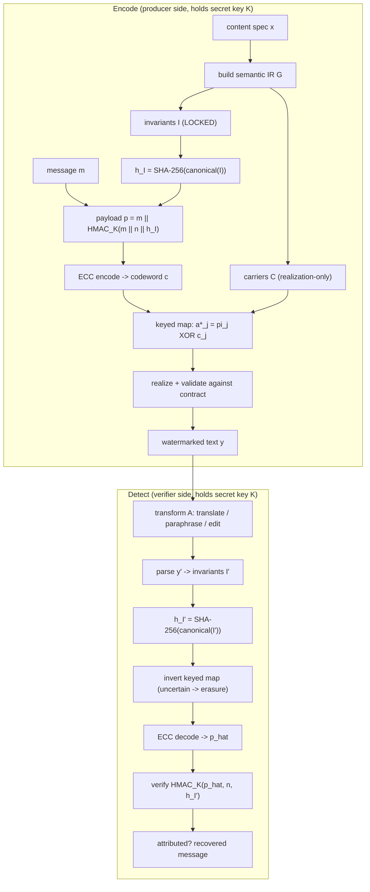
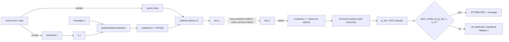

# Truthprint

**Invariant-constrained semantic provenance watermarking for LLM-generated text.**

Truthprint carries a watermark in the *meaning* of text rather than in its
tokens. It locks the truth-conditional content of a passage (entities,
predicates, roles, polarity, quantities, time, attribution) into a typed
**invariant contract**, then encodes an **authenticated, error-corrected
payload** using only the realization freedom that does *not* change that
contract. Because the signal lives above the token surface, it is designed to
survive meaning-preserving transformations such as **paraphrasing and
translation** — where token-level watermarks degrade — while remaining
**machine-readable and unforgeable**.

> This repository is shared in the spirit of *Hongik Ingan* ("benefit all
> humankind"): it is a reference implementation to help researchers reproduce,
> critique, and build on the idea. It is research-grade, not a turnkey
> production system.

[](https://github.com/leemgs/truthprint/actions/workflows/ci.yml)
[](https://www.python.org/)
[](LICENSE)

---

## Why this matters

The EU AI Act (Regulation (EU) 2024/1689), Article 50, requires providers of
generative systems to mark synthetic outputs — **text included** — in a
*machine-readable* format that is *detectable* as AI-generated, effective
August 2026. A mark that is machine-readable yet trivially erased by
translation or paraphrasing does not meet that intent. Truthprint targets
exactly this gap: a durable, authenticated provenance mark.

## Key properties

| Property | What it means | Where |
|---|---|---|
| Semantic fidelity by construction | Watermarking never alters locked meaning; carriers with no valid realization become erasures | `invariants`, `linguistic` |
| Unforgeability | Forging attribution reduces to forging the MAC (HMAC-SHA256) | `payload` |
| Bounded false positives | Cryptographic FP rate ≤ 2⁻ᵗᵃᵘ (0 observed over 20k trials at τ=32) | `payload`, `tests` |
| Erasure resilience | Full payload recovery up to a code-rate-dependent erasure cliff | `coding` |
| No global carrier rule | Keyed map is bound to (key, invariant digest, nonce) | `carriers` |

---

## Repository layout

```
truthprint/
├── truthprint/            # the package (standard-library only)
│   ├── invariants.py      # canonical invariant digest h_I, InvariantEq
│   ├── payload.py         # authenticated payload  p = m || HMAC_K(m||n||h_I)
│   ├── coding.py          # systematic GF(2) code + erasure decoding
│   ├── carriers.py        # secret-keyed, invariant-bound carrier map
│   ├── core.py            # Truthprint codec (encode / detect) over carriers
│   ├── linguistic.py      # closed-domain realize/parse on real sentences
│   ├── baselines.py       # faithful reductions of KGW/SynthID, DEW, SemStamp, SWAN
│   └── cli.py             # `truthprint {selftest,demo-core,demo-linguistic,repro-table}`
├── examples/              # minimal runnable examples
├── scripts/               # reproduce-table + eval_baselines (paper Tables V/VI)
├── tests/                 # pytest suite (also the reproducibility harness)
└── .github/workflows/     # CI running tests on Python 3.9/3.11/3.12
```

---

## Getting started

### Install

```bash
git clone https://github.com/leemgs/truthprint
cd truthprint
python -m pip install -e ".[dev]"     # editable install + pytest
```

The core has **no runtime dependencies** (Python ≥ 3.9, standard library only).
`pytest` is only needed to run the test suite.

### 60-second check

```bash
truthprint selftest          # runs properties P1–P4 and L1–L3, prints PASS
pytest -q                    # full test suite
truthprint repro-table       # regenerate the erasure-cliff table
```

### Use the core codec (abstract carriers)

```python
from truthprint import Truthprint

tp = Truthprint(key=b"your-32-byte-secret-key-here-0123", msg_len=16, tag_bits=32)

invariants = {"events": [{"predicate": "FIX", "agent": "developer",
                          "patient": "server_error", "polarity": "positive"}]}
message = [1, 0, 1, 1, 0, 0, 1, 0, 1, 1, 1, 0, 0, 1, 0, 1]   # 16 bits
nonce = tp.new_nonce()

options = tp.encode(invariants, message, nonce)               # realized carriers
mask = [i % 10 < 3 for i in range(tp.n_carriers)]             # ~30% erased
result = tp.detect(invariants, options, nonce, erasure_mask=mask)

print(result.attributed, result.message == message)           # True True
```

### Use the linguistic layer (real sentences)

```python
import random
from truthprint.linguistic import Fact, LinguisticCodec, invariant_preserving_transform

facts = [Fact("the developer", "the server error"),
         Fact("the auditor", "the data leak")] * 8            # 16 sentences
codec = LinguisticCodec(b"your-32-byte-secret-key-here-0123",
                        n_sentences=len(facts), msg_len=8, tag_bits=16)
msg, nonce = [random.randint(0, 1) for _ in range(8)], codec.core.new_nonce()

sentences = codec.encode(facts, msg, nonce)
rng = random.Random(0)
transformed, reliability = zip(*(invariant_preserving_transform(s, rng, 0.25)
                                 for s in sentences))
result = codec.detect(list(transformed), nonce, list(reliability))
print(result.attributed, result.message == msg)
```

> **Capacity guidance.** The payload has `msg_len + tag_bits` bits and the code
> rate is `(msg_len + tag_bits) / n_carriers`. Recovery is reliable only while
> the carrier erasure rate stays below `1 − rate`. Give yourself margin: pick a
> rate around 0.3–0.5 (e.g. `n_carriers ≥ 2 × (msg_len + tag_bits)`) so the
> watermark survives realistic paraphrase/translation erasures.

---

## How it works

### Architecture / operation flow



The invariant digest `h_I` binds the payload: if a transformation changes a
**locked** field (e.g. flips polarity), `h_I` changes and the MAC fails — no
false attribution. If it only changes **realization** (voice, word order,
language), the invariants and enough carriers survive, and the
error-correcting code recovers the payload.

### Data flow



### Encode & detect sequence

```mermaid
sequenceDiagram
    autonumber
    participant U as Producer
    participant E as Encoder (key K)
    participant T as Transform
    participant D as Detector (key K)
    U->>E: invariants I, message m, nonce n
    E->>E: h_I = digest(I)
    E->>E: p = m || MAC_K(m, n, h_I)
    E->>E: c = ECC(p); options = keyedMap(c, K, h_I, n)
    E-->>T: watermarked text y
    T-->>D: transformed text y'
    D->>D: parse y' -> I'; h_I' = digest(I')
    D->>D: invert keyed map (erasures) -> received
    D->>D: p_hat = ECC.decode(received)
    D->>D: ok = verify MAC_K(p_hat, n, h_I')
    D-->>U: attributed = ok; message = p_hat[:len(m)]
```

---

## Reproducibility

Every claim in the paper's core is a runnable test.

| ID | Property | Test |
|---|---|---|
| P1 | Payload recovery under 30% carrier erasure | `tests/test_roundtrip.py::test_P1_recovery_under_erasure` |
| P2 | Invariant tamper breaks attribution | `test_P2_invariant_binding` |
| P3 | Cryptographic false positives = 0 / 5000 | `test_P3_cryptographic_false_positive_rate` |
| P4 | Keyed map is invariant/nonce-bound | `test_P4_no_global_rule_via_detect` |
| L1 | Invariant fidelity through benign rewrites | `test_L1_invariant_fidelity_and_L2_recovery` |
| L2 | Sentence-level recovery under erasure | `test_L1_invariant_fidelity_and_L2_recovery` |
| L3 | Negation tamper is rejected | `test_L3_tamper_detection` |

```bash
pytest -q                 # all properties
truthprint repro-table    # erasure-rate vs recovery-rate (confirms the cliff)
```

Expected `repro-table` shape (rate-1/2 code): ~1.00 recovery up to 40% erasure,
collapsing near 50% — the recovery cliff at `erasure ≈ 1 − rate`.

---

## Baseline comparison (paper Tables V & VI)

`truthprint/baselines.py` provides faithful, standard-library-only reductions
of four published watermarks — evaluated on the **same** closed-domain Stage-1
testbed as Truthprint so the comparison is apples-to-apples in the absence of a
neural frontend. Each baseline reproduces its method's *detection statistic* and
*signal placement*:

| Baseline | Signal layer | Translation survival |
|---|---|---|
| `KGWGreenList` (SynthID-Text/KGW) | token identity (green-list bigram) | `~(1−τ)²` → collapses |
| `DEWEditRobust` (DEW) | edit-aligned token bit | `~(1−τ)` up to an edit budget, then collapses |
| `SemStampLSH` (SemStamp) | sentence-embedding LSH region | meaning-dominant → robust |
| `SWANStructural` (SWAN) | AMR / meaning structure | unaffected by τ; loses only `ε` parse fraction |

A single meaning-preserving channel `channel(doc, tau_tok, eps_inv)` drives all
methods; each one's survival is *derived* from where its signal lives, so the
ordering is forced by signal placement rather than tuned per method.

```bash
python scripts/eval_baselines.py   # regenerates Tables V (clean) and VI (translation)
pytest -q tests/test_baselines.py  # qualitative regression bounds
```

Measured outcome (500 docs × 32 sentences, threshold at 1% FPR): on **clean
text** all methods detect at TPR = 1.000 / ROC-AUC = 1.000; under **translation**
the token-level marks (SynthID-Text/KGW, DEW) collapse to the noise floor while
the semantic-layer marks (SemStamp, SWAN, Truthprint) survive. Truthprint is
comparable to SWAN on raw detection; its advantage over these semantic baselines
is the **authenticated, invariant-bound recovery** (P2/P3) that they lack —
neither SWAN nor SemStamp carries a MAC or an erasure code.

> **Scope.** These are controlled reference reductions, not neural benchmarks.
> They abstract each method's neural frontend (LM sampler, sentence encoder, AMR
> parser) in exactly the way the Truthprint Stage-1 numbers do. Full neural
> evaluation is the paper's future work.

---

## Mapping to the paper

| Paper symbol | Meaning | Code |
|---|---|---|
| `h_I` | canonical invariant digest | `invariants.canonical_digest` |
| `p` | authenticated payload | `payload.authenticate_payload` |
| MAC verify | tag check | `payload.verify_payload` |
| `ECC` / decode | GF(2) code + erasure decode | `coding.GF2Code` |
| `pi_j`, `a*_j` | keyed offset / realized option | `carriers.keyed_bit`, `realize_option` |
| `D_K` | detector | `core.Truthprint.detect` |

Primitives are fixed and explicit: SHA-256 over canonical JSON for `h_I`,
HMAC-SHA256 truncated to τ bits for the tag, `a*_j = pi_j XOR c_j` for binary
carriers, and a systematic `[n, k]` GF(2) code with Gaussian-elimination
erasure decoding.

## Scope & limitations

- The linguistic layer is a **closed-domain, rule-based** Stage-1 demonstrator
  (two carriers: voice and time-position). It proves the pipeline round-trips
  on real strings; it is **not** a wide-coverage semantic parser. Extending
  `realize`/`parse` and adding a robust parser is the main open problem.
- Binary carriers only in this reference; higher-arity carriers are a natural
  extension of `carriers.py` and `coding.py`.
- Truthprint provides **authenticated, transformation-robust attribution**; it
  does **not** claim cryptographic *undetectability*.

## Contributing

Issues and PRs are welcome — especially wider-coverage parsers, new carrier
families, additional languages, and attack evaluations. Please run
`pytest -q` and `truthprint selftest` before submitting.

## License & citation

MIT licensed (see [LICENSE](LICENSE)). If you use this work, please cite the
accompanying paper (see [CITATION.cff](CITATION.cff)).
